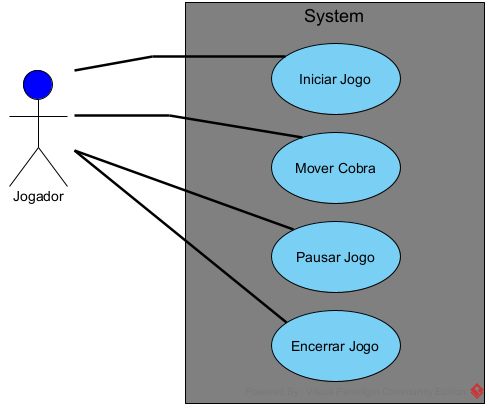
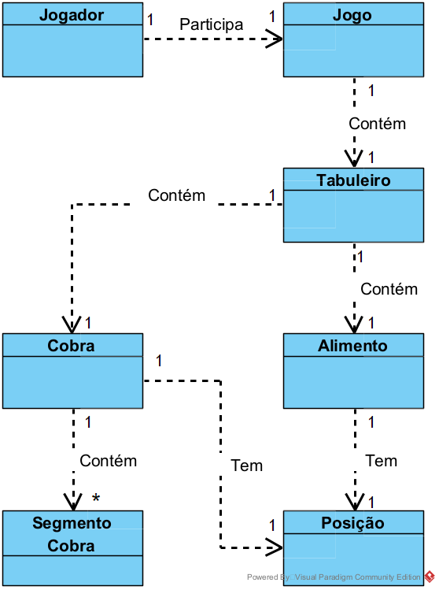

# Análise orientada a objeto
> [!NOTE]
> A **análise** orientada a objeto consiste na descrição do problema a ser tratado, duas primeiras etapas da tabela abaixo, a definição de casos de uso e a definição do domínio do problema.

## Descrição Geral do domínio do problema

Descrever de forma geral o domínio do problema.

Possíveis requisitos funcionais e não-funcionais podem ser elencados aqui.

## Diagrama de Casos de Uso

     
Apresentar o diagram de casos de uso, identificando as funcionalidades do sistema assim como os atores envolvidos
 
## Diagrama de Domínio do problema

Elaborar um diagrama conceitual do domínio do problema.

[Retroceder](README.md) | [Avançar](implementacao.md)

