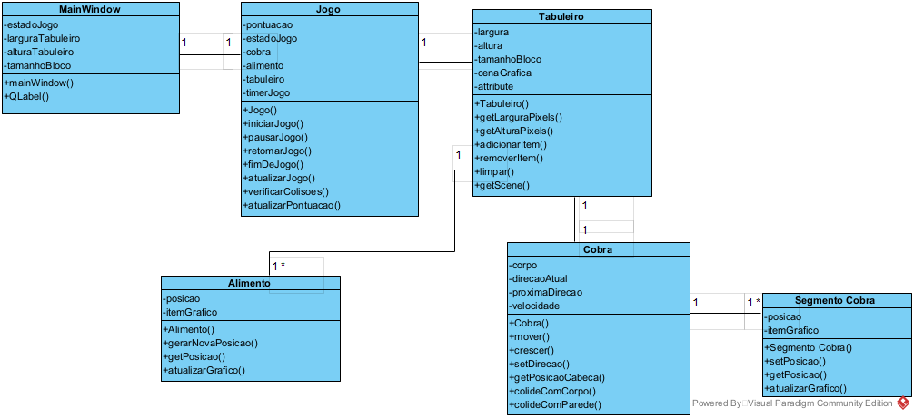

# Projeto orientado a objeto

# Explicação dos arquivos do Projeto da Cobrinha

    • posicao.h:  Declara Posição como um typedef de QPoint.
    
    • segmentocobra.h / segmentocobra.cpp: Declaram e implementam a classe SegmentoCobra, que representa um 
    pedaço do corpo da cobra e sabe como se desenhar (QGraphicsRectItem).

    • cobra.h / cobra.cpp: Declaram e implementam a classe Cobra, que gerencia a lista de segmentos, 
    sua direção e lógica de movimento e colisão interna.
    
    • alimento.h / alimento.cpp: Declaram e implementam a classe Alimento, que representa a comida e sabe 
    como se desenhar e gerar novas posições.
   
    • tabuleiro.h / tabuleiro.cpp: Declaram e implementam a classe Tabuleiro, que atua como a área de jogo visual (QGraphicsView e QGraphicsScene) onde a cobra e o alimento são 
    exibidos.

    
    • jogo.h / jogo.cpp: Declaram e implementam a classe Jogo, que é o "cérebro" do jogo. Ela contém instâncias da Cobra, Alimento e Tabuleiro, e gerencia o loop do jogo, a pontuação, o estado e as colisões entre os elementos.

    
    • mainwindow.h / mainwindow.cpp / mainwindow.ui: São os arquivos da janela principal. A MainWindow configura a interface (botões, labels), cria uma instância de Jogo e Tabuleiro, e lida com eventos do teclado para passar para a lógica do jogo.

    
    • main.cpp: O ponto de partida que inicia a aplicação Qt e sua MainWindow.

[Retroceder](implementacao.md) | [Avançar](teste.md)

